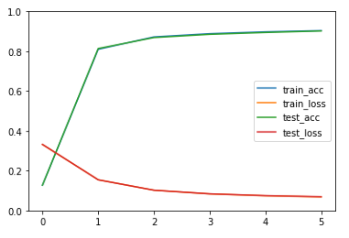
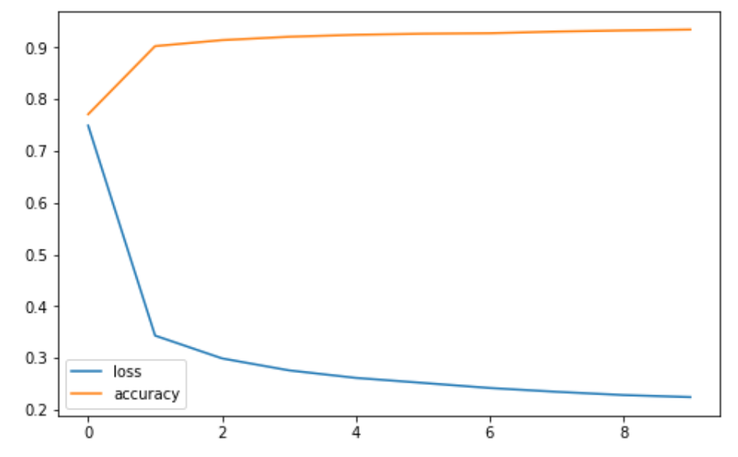

# Лабораторная работа по курсу "Искусственный интеллект"
# Многослойный персептрон

| Студент | Гамов Павел Антонович |
|------|------|
| Группа  | м80-407б-18 |
| Вариант | 2 |
| Оценка 1 (свой фреймворк) | *X* |
| Оценка 2 (PyTorch/Tensorflow) | *X* |
| Проверил | Сошников Д.В. |

> *Комментарии проверяющего*
### Задание

Решить задачу классификации для датасетов MNIST, FashionMNIST, CIFAR-10 с помощью 1, 2 и 3-слойного персептрона. Попробовать разные передаточные функции, провести сравнительную оценку решений. Решение сделать двумя способами:
* "С нуля", на основе базовых операций библиотеки numpy. Решение желательно реализовать в виде библиотеки, пригодной для решения более широкого круга задач.
* На основе одного из существующих нейросетевых фреймворков, в соответствии с вариантом задания:
   1. PyTorch
   1. Tensorflow/Keras

> *Номер варианта вычисляется по формуле 1 + (N-1) mod 2, где N - номер студента в списке.*

Решение оформить в файлах [Solution_MyFramework.ipynb](Solution_MyFramework.ipynb) и [Solution.ipynb](Solution.ipynb). 
Отчет по работе и сравнение методов пишется в этом файле после задания.
### Критерии оценки

Первая часть лабораторной работы:

| Сделано | Баллы |
|---------|-------|
| Реализован однослойный персептрон, классифицирующий датасет с точностью >85% | 1 |
| Реализован многослойный персептрон, классифицирующий датасет с точностью >85% | 2 |
| Реализация сделана как библиотека для обучения сетей различных конфигураций, в соответствии с примером | 1 |
| Улучшена архитектура библиотеки, отдельно вынесены алгоритмы обучения, функции потерь | 3 |
| Проведено сравнение различных гиперпараметров, таких, как передаточные функции, число нейронов в промежуточных слоях, функции потерь, с графиками обучения и матрицами неточности | 2 |
| Проведен анализ для датасета FashionMNIST | 1 |

Вторая часть лабораторной работы:

| Сделано | Баллы |
|---------|-------|
| Реализован однослойный персептрон, классифицирующий датасет с точностью >85% | 1 |
| Реализован многослойный персептрон, классифицирующий датасет с точностью >85% | 2 |
| Реализация использует возможности базового фреймворка, включая работу с данными | 3 |
| Проведено сравнение различных гиперпараметров, таких, как передаточные функции, число нейронов в промежуточных слоях, функции потерь, с графиками обучения и матрицами неточности | 2 |
| Проведен анализ для датасета FashionMNIST | 1 |
| Проведен анализ для другого датасета с цветными картинками (CIFAR-10) | 1 |

## Отчёт по работе

В первой лабораторной работе я реализовал собственный класс нейронной сети, которая распознает изображения с точностью выше 85 процентов.

В показал работу модели состоящей из одного слоя, а также из двух слоев. На конце каждой из которых находится softmax слой.

Также я попробывал научить нейронную сеть на базе данных FashionMNIST, но как бы я не старался, сеть не учится дальше 10 процентов, а при больших количествах слоев скорость обучения и прогонки даты возрастает.

Во второй лабораторной работе я научился обучать нейронную сеть с помощью библиотеки Keras. В отличие от первой, здесь надо было основательно разобраться в параметрах, функциях и структуре. Но данная библиотека справляется с обучением гараздо лучше написанной мной.

За 5 итераций она обучилась на 93 процентов, что видно на графике, тестовая выборка также показывает 93 процента точности.

Что касается FashionMNIST, то мне удалось обучить модель до 86 процентов, используя 2 скрытых слоя.

Однако тестовая выборка показывает точность чуть менее 85 процентов.

## Материалы для изучения

 * [Реализация своего нейросетевого фреймворка](https://github.com/shwars/NeuroWorkshop/blob/master/Notebooks/IntroMyFw.ipynb)
 * [Введение в PyTorch](https://github.com/shwars/NeuroWorkshop/blob/master/Notebooks/IntroPyTorch.ipynb)
 * [Введение в Tensorflow/Keras](https://github.com/shwars/NeuroWorkshop/blob/master/Notebooks/IntroKerasTF.ipynb)
