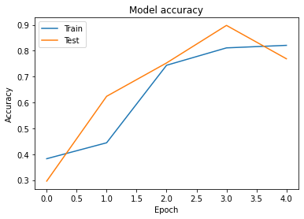
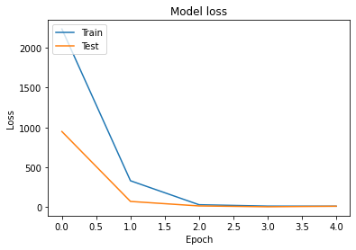
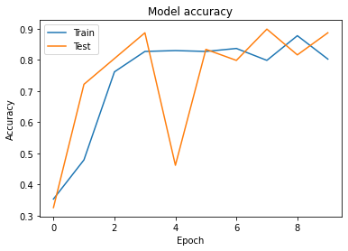
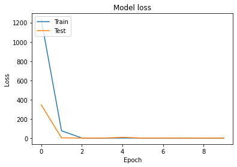

# Отчет по лабораторной работе
## по курсу "Искусственый интеллект"

## Нейросетям для распознавания изображений


### Студенты:

| ФИО        | Роль в проекте                            | Оценка       |
|------------|-------------------------------------------|--------------|
| Гамов П.А  | обработка изображений, подготовка датасета|              |
| Шичко А.И. | обучение полносвязной н.с.                |              |
| Хренов Г.Н.| обучение сверточной н.с., тимлид          |              |

## Результат проверки

| Преподаватель     | Дата         |  Оценка       |
|-------------------|--------------|---------------|
| Сошников Д.В. |              |      4         |

> *Комментарии проверяющих (обратите внимание, что более подробные комментарии возможны непосредственно в репозитории по тексту программы)*

## Тема работы

Создание классификатора на базе нейронных сетей, который по изображению определяет, какая из 3 букв (Э, Ю, Я) на нем написана.

## Подготовка данных

<!-- Приведите фотографии исходных листков с рукописными символами:


Как осуществлялась подготовка датасета? С какими сложностями пришлось столкнуться? Фрагменты кода для разрезания картинки на части...

Ссылка на получившийся датасет: ... -->

Для получения датасета каждым из участников было написано по 100 примеров каждой буквы. Получилось 3 фотографии в общем по 300 каждой буквы.

Пример рукописных символов:


Сначала мы занялись поиском сервиса, который мог бы нарезать буквы на более маленькие фотографии, далее которые можно было бы изменить до нужных нам размеров 32х32 пикселей. Но так как мы писали на белой бумаге без линеек, строчки получились немного кривые и серисы не могли нарезать достаточно правильно. Так что решением проблемы стало написание программы, которая способна облегчить нарезку датасета.

```python
while(1):
    cropped = image[x:x+xl, y:y+yl]
    to_show = cv2.resize(cropped, (300, 300), interpolation = cv2.INTER_AREA)
    cv2.imshow("show image", to_show)
    k = cv2.waitKey(33)
    if k == 27:    # Esc key to stop
        break
    elif k == -1:  # normally -1 returned,so don't print it
        continue
    elif k == 119: # pressed w
        x = max(0,x-step_coord)
    elif k == 115: # pressed s
        x = min(image.shape[0]-xl,x+step_coord)
    elif k == 97: # pressed a
        y = max(0,y-step_coord)
    elif k == 100: # pressed d
        y = min(image.shape[1]-yl,y+step_coord)
    elif k == 13: # pressed enter
        cv2.imwrite(path_to_save+str(x)+'_'+str(y)+'.jpg', cv2.resize(cropped, (32, 32), interpolation = cv2.INTER_AREA))
```

Выше фрагмент кода, который делает из нарезки датасета настоящую игру со своим управлением. Используя модули cv2 и os, кнопками WASD можно перемещаться по картинке находя фрагменты, которые нужно вырезать, далее как только мы отцентруем картинку, нажимаем Enter и программая сохраняет картинку в размере 32 на 32 пикселя в папку, которую мы указали. Таким образом нарезка датасета стала более простой и нарезать все 900 символов получилось примерно за 20-30 минут.

Пример полученных картинок:


## Загрузка данных

## Обучение нейросети

### Полносвязная однослойная сеть
**Архитектура**

```
Model: "sequential"
_________________________________________________________________
Layer (type)                 Output Shape              Param #   
=================================================================
dense (Dense)                (None, 32, 32, 512)       2048      
_________________________________________________________________
flatten (Flatten)            (None, 524288)            0         
_________________________________________________________________
dense_1 (Dense)              (None, 3)                 1572867   
=================================================================
Total params: 1,574,915
Trainable params: 1,574,915
Non-trainable params: 0
_________________________________________________________________
```

**Результаты**




### Полносвязная многослойная сеть
**Архитектура**

```
Model: "sequential_1"
_________________________________________________________________
Layer (type)                 Output Shape              Param #   
=================================================================
dense_2 (Dense)              (None, 32, 32, 64)        256       
_________________________________________________________________
dense_3 (Dense)              (None, 32, 32, 256)       16640     
_________________________________________________________________
flatten_1 (Flatten)          (None, 262144)            0         
_________________________________________________________________
dense_4 (Dense)              (None, 3)                 786435    
=================================================================
Total params: 803,331
Trainable params: 803,331
Non-trainable params: 0
_________________________________________________________________
```

**Результаты**




### Свёрточная сеть
**Архитектура**  

Первый слой - сверточный двухмерный (Conv2D) . Hазмер ядра 3х3 исходя из размера изображения. Число ядер свертки(сколько признаком будем искать) - 32  
Далее слой пулинга по максимому  
После чего еще один сверточный двухмерный с повышенным числом свертки - 64  
Далее применяем слой Flatten для представления данных в виде вектора  
На финальном этапе - полносвязный слой  

**Результаты**  

  
  

## Выводы

Сверточные сети оказались более эффективными при работе с изображениями, так как они больше для этого приспособлены. Свёрточными сети называются так из-за операции свертки, которая является основой всей сети. В этих сетях нету привычных связей и весовых коэффициентов. Вместо этого используется ядро свертки. Операция свертки выделяет какой-то признак в картинке, будь то наклонные прямые линии или изгибы. И по схожести таких признаков уже можно судить о схожести изображений в целом.   

<!-- Сформулируйте *содержательные* выводы по лабораторной работе. Чему он вас научила? -->
<!-- Над чем заставила задуматься? В чём состояли основные сложности в работе? Насколько эффективной получилась командная работа, и какие методы для повышения эффективности командной работы вы использовали (scrum, slack, ...)? -->
<!--  -->
<!-- Помните, что несодержательные выводы - -->
<!-- самая частая причина снижения оценки. -->
